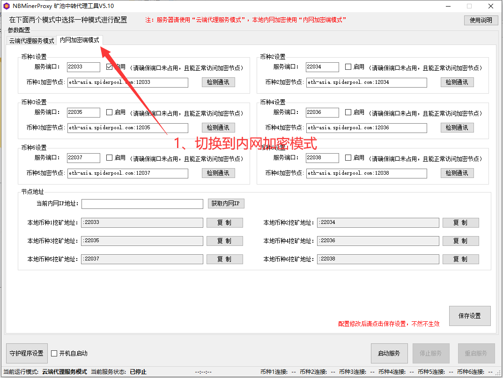
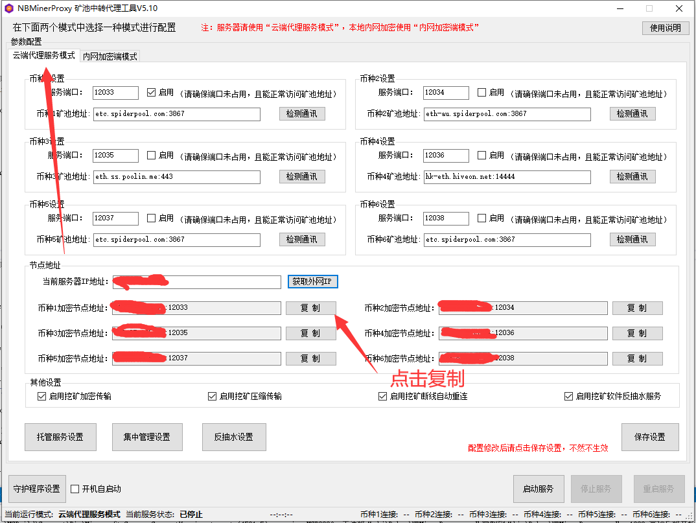
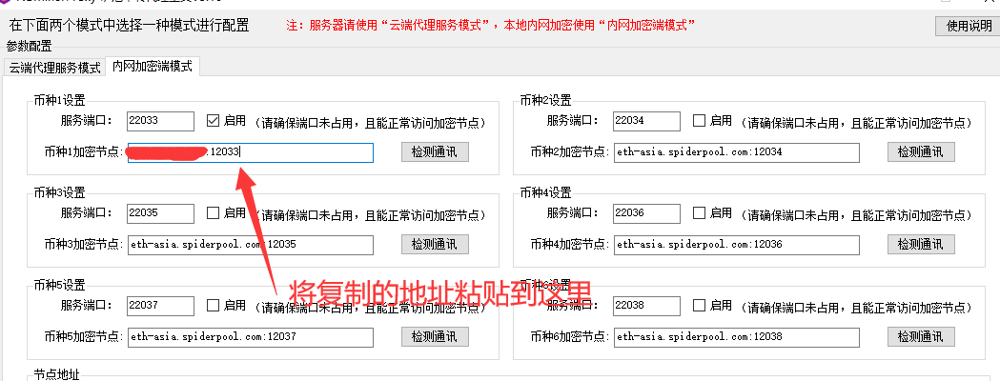
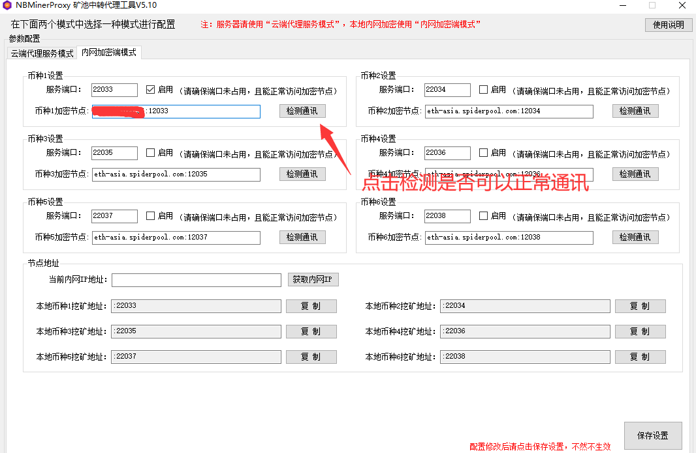
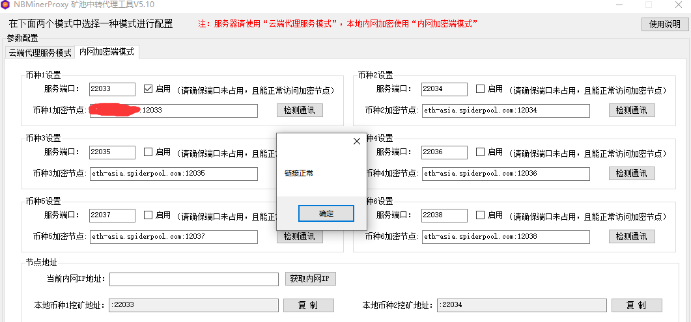
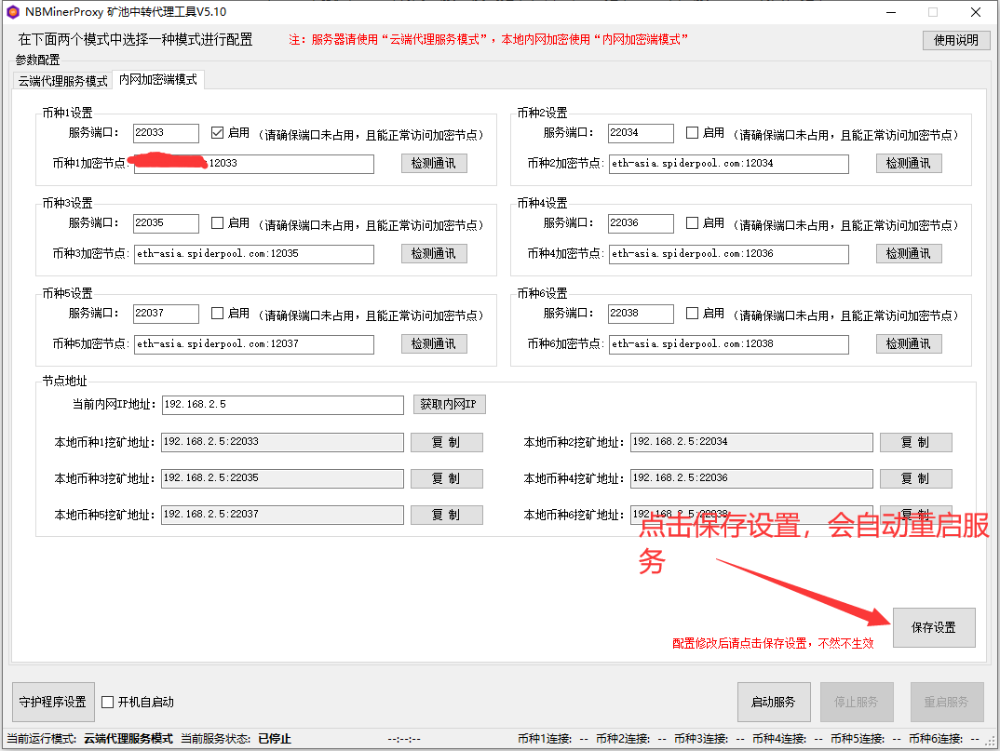
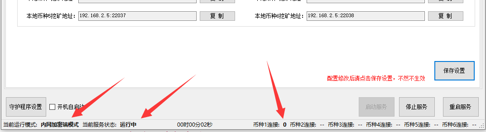

# NBMinerProxy	

   NBMinerProxy 是一个挖矿代理软件。

## 1、NBMinerProxy什么作用？	

   NBMinerProxy目前支持ETH、ETC等代理支持多个端口代理不同矿池和币种，支持本地局域网安装，可集中管理您的矿机，做到一键更改矿池和钱包地址，集中管理矿机，加密，集中反抽水。 NBMinerProxy支持VPS安装，为您存放在不同地域不同钱包的矿机提供矿池代理服务。	

## 2、NBMinerProxy模式分别什么作用？	

   云端代理服务模式：该模式下软件需运行于服务器上，通过设置矿池地址和服务器端口，解决目前无法直连矿池和挖矿数据解密问题。
   内网加密端模式：该模式下软件在矿机本机或者局域网统一接收处理挖矿软件的数据加密后传输到服务器云端，主要用于内网和服务器之间的加密通讯传输问题。

## 3、NBMinerProxy如何切换模式？	

   在需要启动的模式选项卡下面点击“保存设置”即可切换。软件最底部可区分当前软件模式以及运行转态

## 4、NBMinerProxy是怎么使用的？	

   方案一：单独只使用云端代理服务模式挖矿，那么您的挖矿地址就是服务器IP:端口，挖矿软件的矿池地址填写<服务器IP:端口>，挖矿软件单独连接您自己的服务器，服务器帮助您把算力推送到矿池;  
   方案二：使用云端代理+本地内网加密，内网加密端是架设在内网或者矿机本身的加密转发软件，启动后挖矿软件的矿池地址填写<192.168.0.X:端口>，挖矿软件将算力推送到内网加密端，内网加密端将算力解密后推送到云端代理服务器，服务器将算力转发到矿池，这个过程实现了加密挖矿和独立代理挖矿，能有效绕过网络监管。

## 5、NBMinerProxy怎么盈利的？  

  NBMinerProxy接收您的主动捐赠，让软件越做越好，所有捐赠行为均取决您的选择！
	ETH钱包：0x92efBa733B0Fd74c0A82f133b464e51A6d36f9aE  

##  6、NBMinerProxy支持哪些币种？  

  目前支持ETH、ETC两种  

## 7、NBMinerProxy支持哪些矿池？  
  基本上所有支持市面全部ETH、ETC的矿池都能连接  

## 8、NBMinerProxy支持不同矿池同时连接吗？  

  NBMinerProx支持最多六个不同矿池同时连接，每个矿池必须设置不同端口 。

## 9、NBMinerProxy的托管服务是什么？  

  托管服务功能主要用于分担运营人员维护费用，按一定比例给运营人员钱包挖矿。目前最大比例为2%,当比例调整为0时，软件会自动关闭此功能。  

## 10、NBMinerProxy集中管理是什么？  

  本功能开启后，通过本软件的算力的钱包全部更改为你设置的集中钱包，不管你挖矿软件上、矿机上设置的是什么钱包，都会更改为集中钱包。  

## 11、NBMinerProxy反抽水设置是什么？ 

  本功能会抓取到目前在挖矿的全部钱包地址，用户可以将所有拦截到的抽水钱包地址替换为反抽水钱包，从而达到反抽水的目的;  

## 12、NBMinerProxy守护程序设置是什么功能？  

  本功能主要用于监控软件是否出现异常状态，发现软件崩溃或者关闭会自动重启软件，避免维护人员休息时软件异常导致的无法正常挖矿；（建议开启）  

## 内网加密端模式 的使用步骤
### 1、启动软件切换到内网加密端模式

### 2.设置加密连接
   到云端代理服务器上打开软件复制加密连接地址  

	注意是云端代理服务器上的软件，不上在当前本地服务器上这个软件
   

   将连接地址粘贴到本地软件中  
     
     

### 3.检测通讯是否正常  
点击检测通讯按钮，检测连接是否正常。  

  

看到如图所示表示连接正常  

  

### 4.保存设置&启动服务  
点击右下角保存设置，保存当前的配置，并启动服务
  

查看软件底部，当前服务运行状态  

  

### 5、复制本地挖矿地址到挖矿软件

